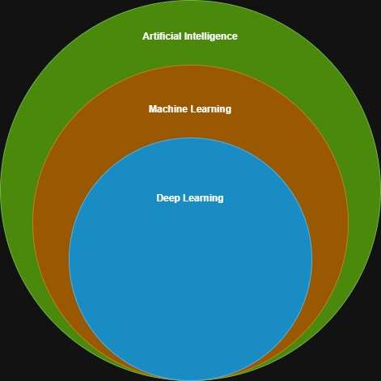

Word Artificial Intelligence first coined by John McCarthy in 1956
---

**Domains of AI**

* Machine learning
* Deep learning / Neural networks
* Natural Language Processing (NLP)
* knowledge base
* Expert systems
* Robotics
* Fuzzy Logic
* Application in Computer Vision and Image processing

---

**Stage of AI**

* Artificial Narrow Intelligence - ANI - Weak AI
* Artificial General Intelligence - AGI - Strong AI
* Artificial Super Intelligence

**Artificial Narrow Intelligence**
* Performs certain tasks. Examples like Alexa, Siri, Self driving cars etc

**Artificial General Intelligence**
* Strong AI. Machines posses the ability to think and take decisions just like human beings

**Artificial Super Intelligence**
* when capability of computers surpass human beings

---

**Types of AI**

* Reactive Machines AI - Operates solely based on present data. Take into consideration only current situation. Cannot form inferences from data to evaluate any future actions. Perform narrowed range of predefined tasks. Ex: IBM chess program that beat the world champion Garry Kasparov(1997). One of the impressive machine build so far

* Limited Memory AI - Can make informed and improved decision by studying past data from its memory. Has short-lived or temporary memory that can be used store past experiences and evaluate future actions. Ex: Self driving cars. Has limited memory that use data collected in the recent pasts to make immediate decisions. 

* Theory of Mind AI - more advanced type of AI. This category play important role in psychology. Mainly focus on emotional intelligence so that humans beliefs and thoughts can be better comprehended. Not fully developed yet but rigorous research is happening in this area

* Self Aware AI - Machines has own consciousness and self-aware. 

---

**Machine Learning**

* Making machines to interpret, process and analyze data to solve real world problems.
* Sub types - Supervised, Unsupervised, Reinforcement

---

**Deep learning / Neural networks**

* Process of implementing neural networks on high dimensional data to gain insights and form solutions
* Logic behind **-** face recognition algorithms (in facebook), Self driving cars, Virtual assistance like Alexa, Siri etc

---

**Natural Language Processing (NLP)**

* Drawing insights from natural human language in order to communicate with machines and grow businesses
* Ex: Twitter - Uses NLP to filter terroristic language in tweets
* Ex: Amazon - Uses NLP to understand customer reviews and improve user experience

---

**Robotics**

* Focus on different branches and applications of robots
* AI robots are artificial agents which act in real world environment to produce results and taking some accountable actions.
* Ex: Sophia the Humanoid is very good example AI in robotics

---

**Fuzzy Logic**

* Computing approach that is based on principle of degree of truth instead of usual modern logic that we use which is basically the Boolean logic. Used in medical fields to solve complex problems which involve decision making. Also used in automating gear systems in cars

---

**Expert System**

* AI based computer system that learns and reciprocates decision making ability of human expert
* Uses if then logic notions to solve any complex problems
* Do not rely conventional procedural programming
* Used in information management, fraud detection, virus detection, managing medical and hospital records

---
## AI vs Machine Learning vs Deep Learning

---
LLM - Large Language Model
Model is an Algorithm with pre-trained dataset

Generative AI - Software which interacts using native language with LLMs which is pre-trained with existing datasets and can generate artifacts out of existing trained datasets based on it's neural network

LLM has Foundational Model (which we train using datasets). It has modules for text, image, video processing for individual use cases.

---
Common LLMs:
* Open AI - GPT
* Google - Gemini(Ultra, Pro, Nano), PaLM 2
* Meta - Llama 2
* Cohere - Coral
* xAI - Grok

---
## AI ML hierarchy from low to high
* GenAI -> Deep Learning -> Machine Learning (Supervied/NonSupervised/ReInforced) -> Artifical Intelligence

---
Prompt Engineering: How to talk to AI efficiently?
* fine tune models using prompts
* zero-shot, one-shot, few-shot learning
* Tokens - check chatGPT tokenizer
* BPE - Byte Pair Encoding
* Vectors
* Hallucinations - Like bluf - LLMs can bluf if they don't know answer

---
## RAG - Retrieval Augmented Generation - Scalable Architecture for LLMs
* Architecture using which we can have external datasources be used by LLMs. Also called as GG (Grounded Generation)
* Simple RAG - For example document reading
* Complex RAG - Like food delivery chatbot (get user details, get delivery partner details, his location, calculation distance between customer and delivery partner, tell approximate estimated time)
* LLM with Dynamic Data -> Need RAG Architecture

---
## SLM - Small Language Model
compact and effecient generative ai model designed for understanding and processing human language with fewer parameters than larger models
Some SLMs:
* Ollama - ollama.com
* Google Gemma
* Microsoft - Phi-3, Orca 2
* Mistral AI 70B
* Open AI - GPT-Neo, GPT-J
* BERT - mini, small, medium, tiny, MobileBERT, DistilBERT
* T5-small

---
## ollama - Open source SLM
* download and install
* ollama help - shows list of commands to use
* ollama list - list downloaded models
* ollama run [model-name] - run specific model

---
Refer - https://huggingface.co/

---
## Artificial General Intelligence - AGI - Strong AI
* IBM Deep Blue Chess Game
* TensorFlow
* ScikitLearn
* NumPy
* Theano
* Keras
* Natural Language Analysis with NLTK (Natural Language Tool Kit)

---
# Udemy - the-complete-artificial-intelligence-and-chat-gpt-course
Artificial Narrow Intelligence - ANI - Weak AI
Artificial General Intelligence - AGI - Strong AI
Artificial Super Intelligence - ASI

Artificial Narrow Intelligence - ANI - Weak AI
Simple tasks like voice cloning, self driving cars, recommendation engines
limitations - can't learn beyond specific task, can't adapt to new task
Ex: Siri, Alexa

Artificial General Intelligence - AGI - Strong AI

AI Ethics Organization:
MIRI
Future of Humanity Institute

---------------------------------------
CPU - Central Processing Unit
GPU - Graphical Processing Unit
TPU - Tensor Processing Unit (Invented by Google)

---------------------------------------
Supervised and Unsupervised Machine Learning and Reinforcement Learning

Supervised Learning:
Involved using labeled data. Meaning each piece of data comes with desired outcome or answer

Unsupervised Machine:
Aims to discover underlying patterns or groups in unlabeled data, which is applicable in tasks like customer segmentation and anamoly detection

---------------------------------------
Open source machine learning libraries:
PyTorch
ScikitLearn
TensarFlow

---------------------------------------
NER - Named Entity Recognition
Sub task of information extraction in NLP that seeks to locate and classify named entities in text into pre-defined categories

---------------------------------------
TensarFlow:
Open source AI/ML library platform created by Google

AutoML and Transfer Learning
AutoML: 
Process that finds and tests multiple algorithms based on our data. It tries to leverage other AI algorithms to automatically select what actually works best based on criteria we set. This is called automatic model selection.

Hyper parameters which controls learning process and behavior of our machine learning algorithms. AutoML optimizes these parameters. This process is called `hyper parameter optimization`. AutoML can search for optimal condition automatically for given machine learning model improves performance and reducing time and effor required for manual training. 

Transfer Learning:

---------------------------------------
AI Challenges and Limitations

Data quality and quantity
Bias and Fairness
Explainability and Transperency
Privacy and security
generalization & adaptbility
computational resources
regulation & governance
human-ai collaboration
long-term consequences

---------------------------------------
Job positions in data world:
Data Analyst
Data Scientist
ML Engineer
Data Engineer
BI Analyst
Database Admin
Data Architect

---------------------------------------
GPT - Generative Pre-training Transformer

---------------------------------------
ChatGPT - Chat Generative Pre-trained Transformer
chat.openai.com

Signup
Start prompts
Example prompts: https://github.com/mustvlad/ChatGPT-System-Prompts

---------------------------------------
How to improve prompts:
Be specific and clear
Provide context
Use examples
Ask for step by step reasoning

---------------------------------------
Prompt engineering:
- Directional (or) Instructional Prompting
- Output formatting
- Role based (or) System prompting
- Zero shot prompting
- Few shot prompting
- Chain of Thought prompting

Directional (or) Instructional Prompting:
Give clear and consise instructions to LLMs like ChatGPT

Output formatting:
Guide the model to produce output in specific format, such as JSON, tables, or bullet points, Excel, coding

Role based (or) System prompting:
Ask the model to assume a specific role or persona to generate responses that align with that perspective.

Zero shot prompting:
Provide a prompt without any examples or specific instructions, relying on the model's pre-trained knowledge to generate a response. This approach can be effective for tasks that the model has been trained on and can understand without additional guidance.

Few shot prompting:
Provide a few examples of desired output along with the prompt to help the model understand the expected format and style of the response. This is particularly useful for tasks that require specific formatting or when the model needs to learn from examples to generate accurate responses.

Chain of Thought prompting:
Encourage the model to generate a series of intermediate reasoning steps that lead to the final answer. This can help improve the model's performance on complex tasks that require multi-step reasoning.

---
# Udemy - Intro to AI Agents and Agentic AI
* AI Agents are autonomous in decision making process
* Google Gemini 2.0 - Multimodal AI model designed for `Agentic era`
* Nvidia - Nemo - they call it `AI Team mates`
* Salesforce - Agent force

## Some AI Agents examples
* Self driving car AI Agent
* Shopping Assistant AI Agent

## Key components to build AI agents:
* Environment - where the agent operates
* Sensors - to perceive the environment
* Model - to process information and make decisions
* Decision making logic - how agent select appropriate action
* Actuators - allows agents to interact with environment. To execute actions in the environment
* Feedback machinism/loop- Allow agents to evaluate whether it has successfully achieved its goals and make adjustments accordingly. To learn and improve over time

## Environment - where the agent operates
* AI Agents responds considering digital data, web data to respond based on environments it is working like self driving cars, shopping cart etc

## Sensors - to perceive the environment
* By which agents receives input from their environment
* Allow gathering information like scraping web (apis, intepreting images from cameras, capturing audio through microphones, analyzing data from IoTs). So allowing agents to sense environments and take appropriate actions

## Model - to process information and make decisions
* Like human brain. After collecting data using `sensors`, it fed to `Model` which acts as tool to interpret incoming perceptions.
* Means knowing and understanding information

## Decision making logic - how agent select appropriate action
* Takes input apply structured rules or algorithms to come with recommendation or actions
* Understand and reason internally. Generate and selection appropriate actions
* Sometime need thin decision making layer to confirm like financial transaction need transaction limits and user authentication before approving
* In some cases we can use prompt engineering and assist LLMs

## Actuators - to execute actions in the environment
* Some cases physical actuators like `Robot arm`, `Steering system` of self driving car
* Virtual actuators - APIs to execute

---
# Key characteristics of AI Agents
* Profile & Persona
* Memory
* Reasoning
* Actions
* Learning capabilities

## Profile & Persona
* Define agent leading role and function
* Area of specialization
* Communication style
* Output formatting
* Tone of voice
* Guidelines it should follow
* Unique charecteristics or traits
* How agent should interacts with users
* Values/guidelines the agent should follow
* Unique characteristics or traits

## Reasoning
* Use available information to draw conclusions and solve problems

## Actions
* Steps agent takes to achieve its goals. Like social media post

## Learning capabilities
* Monitor social media post done as part `Actions` and improve next performance task

---
# Simple Reflex Agent
* Fundamental tool reacts based on immediate perception
* No internal memory
* Ex: Thermostat - read environment give temporature. Do not connect to models
* This is not an `AI Agent`. Just `Agent`

---
# Model based reflex agent
* Perceive environment
* Use memory to maintain `internal representation` of environment
* Construct model around them
* Ex: RoboMop - Builds map of premises and obstacles. Then determine which area alreay cleaned
* Simple form of AI
* Doesn't learn or adapt
* Internal model is static or updated through fixed rules
* Follows static rules. Doesn't improve based on experience

---
# Goal based agent
* Search for action sequences to achieve goal and plan actions
* Like Google map shows the route. If we miss anyline it recalculates immediately for next best route
* Sometimes overlook some details, because always focusing on optimizing goal completion

---
# Utility based agent
* Consider multiple factors to evaluate utility

---
# Learning agent
* Similar to utility based agent
* New experiences are added each time. This enhances its ability to operate in unfamiliar environments and improve performance
* Enhances the model over time based on feedback

---
# Learning from humans
* AI Agents require goals and pre defined rules created by humans
* HITL - Human in the Loop - continuous involvement of humans in the training, monitoring, refinining an AI system

## Customer support chatbot
* Select and curate the training data
* Design chatbot's algorithms and architecture
* Set ethical guidelines and constraints
* Define chatbot's specific objectives

## Learning from external systems
* Learning from other agents
* Connecting to external sources like internet, external databases, apis, web searches
* Human feedback
* Collabarative agent-to-agent learning can speed up response times

---
# AI Agent architecture patterns
* LLMs vs AI Workflows vs AI Agents
* Frameworks to build AI Agents - ReAct(Reason and Act), ReWoo(Reasoning Without Observation)
* LLMs and AI Workflows - Need human inputs to perform actions

## AI Agents
* Proactive and flexibility limitations. Don't need HITL to start working
* Figure out best course of action without humans

---
# Single Agent System
* One agent in system

---
# Multi agent system
* Multiple agents in system. Each agent performing one specialized task
* To use multiple agents effectively we need to orchestrate their tasks inside the overall project workflow
* Agents use tool-calling in the backend to obtain up-to-date information, optimize workflows, create sub-tasks autonomously to achieve complex goals

## Ways to orgnize work of multiple agents
* Manager structure
* Decentralized structure