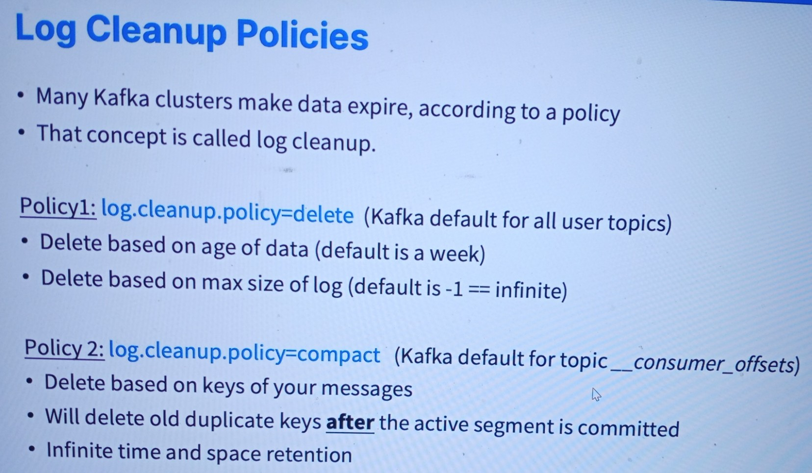

# Log Cleanup Policies
------
* These cleanup policies are crucial for optimizing Kafka's performance and storage management, allowing you to choose the best strategy based on your specific use case and data retention requirements.

### Policy 1: log.cleanup.policy=delete (Kafka default for all user topics)
* Deletes based on the age of data (default is a week).
* Deletes based on the maximum size of log (default is -1, which means infinite size).

### Policy 2: log.cleanup.policy=compact (Kafka default for topic __consumer_offsets)
* Deletes based on the keys of your messages.
* Will delete old duplicate keys after the active segment is committed.
* Infinite time and space retention.

### Explanation:
* Kafka provides two main log cleanup policies to manage data retention and ensure efficient use of storage:
1. log.cleanup.policy=delete
* Age-Based Deletion: Kafka deletes log data based on its age. The default retention period is one week, but you can configure this according to your requirements.
* Size-Based Deletion: Kafka deletes log data based on the maximum log size. The default setting of -1 implies that there is no limit on the log size, meaning logs can grow indefinitely unless you specify a size limit.

2. log.cleanup.policy=compact
* Key-Based Deletion: Instead of deleting logs based on age or size, this policy focuses on the keys of the messages. Kafka retains the latest message for each key and deletes older duplicates.
* Post-Commit Deletion: Old duplicate keys are deleted after the active segment is committed, ensuring that only the most recent data is retained for each key.
* Infinite Retention: By default, there is no time or space limit for logs managed by this policy, making it useful for scenarios where you need to keep the latest state of data indefinitely.
------
