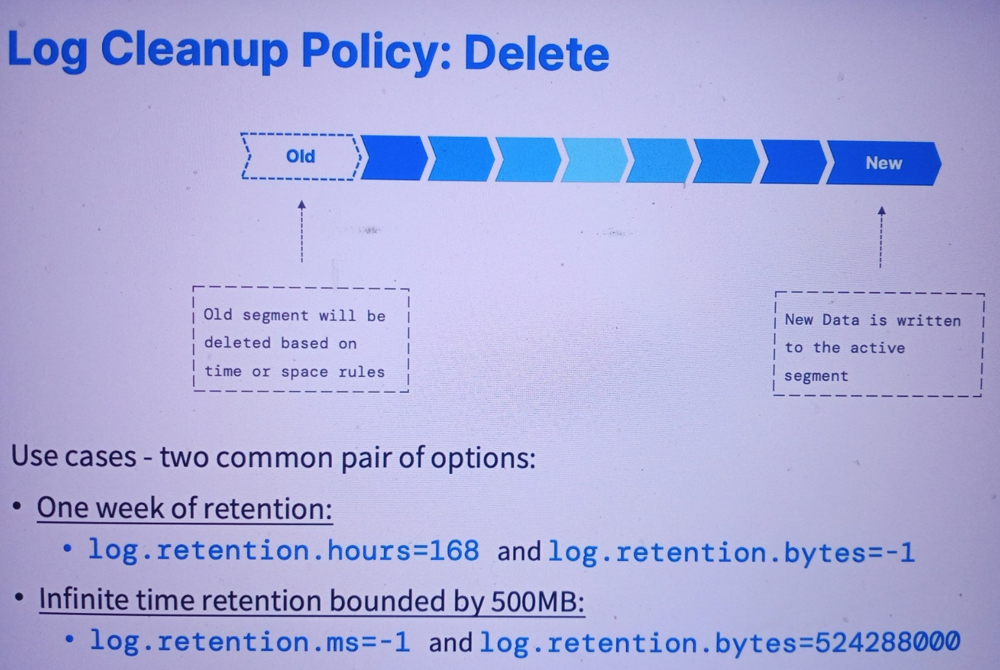
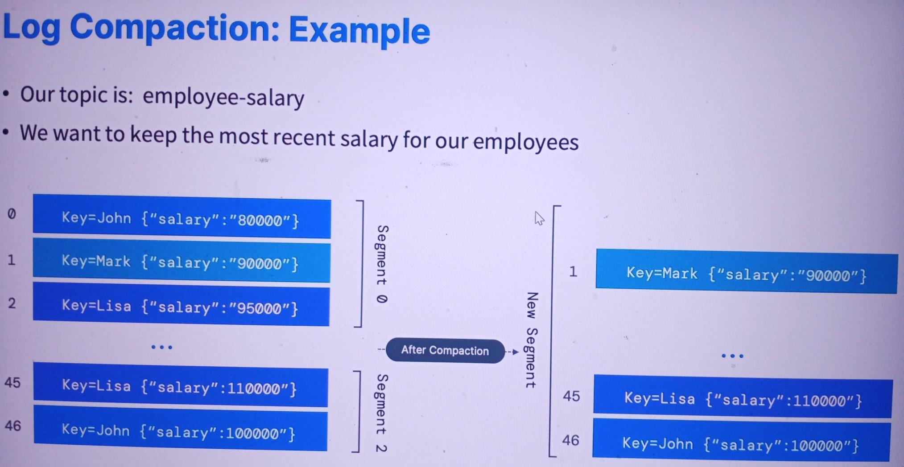
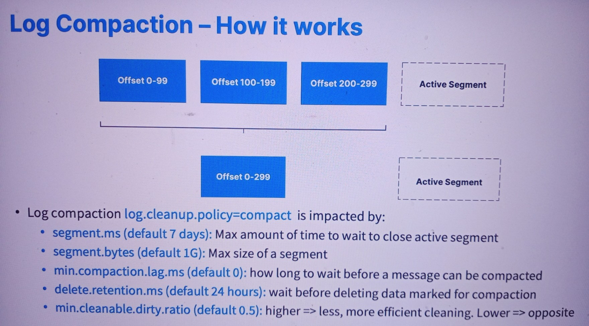

# Log Cleanup Policies
------
* These cleanup policies are crucial for optimizing Kafka's performance and storage management, allowing you to choose the best strategy based on your specific use case and data retention requirements.

### Policy 1: log.cleanup.policy=delete (Kafka default for all user topics)
* Deletes based on the age of data (default is a week).
* Deletes based on the maximum size of log (default is -1, which means infinite size).

### Policy 2: log.cleanup.policy=compact (Kafka default for topic __consumer_offsets)
* Deletes based on the keys of your messages.
* Will delete old duplicate keys after the active segment is committed.
* Infinite time and space retention.

### Explanation:
* Kafka provides two main log cleanup policies to manage data retention and ensure efficient use of storage:
1. log.cleanup.policy=delete
* Age-Based Deletion: Kafka deletes log data based on its age. The default retention period is one week, but you can configure this according to your requirements.
* Size-Based Deletion: Kafka deletes log data based on the maximum log size. The default setting of -1 implies that there is no limit on the log size, meaning logs can grow indefinitely unless you specify a size limit.

2. log.cleanup.policy=compact
* Key-Based Deletion: Instead of deleting logs based on age or size, this policy focuses on the keys of the messages. Kafka retains the latest message for each key and deletes older duplicates.
* Post-Commit Deletion: Old duplicate keys are deleted after the active segment is committed, ensuring that only the most recent data is retained for each key.
* Infinite Retention: By default, there is no time or space limit for logs managed by this policy, making it useful for scenarios where you need to keep the latest state of data indefinitely.
------

------
### Log Cleanup: Why and When?
* Deleting data from Kafka allows you to:
    * Control the size of the data on the disk, delete obsolete data
    * Overall: Limit maintenance work on the Kafka Cluster
* How often does log cleanup happen?
    * Log cleanup happens on your partition segments!
    * Smaller / More segments mean that log cleanup will happen more often!
    * Log cleanup should not happen too often => takes CPU and RAM resources
    * The cleaner checks for work every 15 seconds (log.cleaner.backoff.ms)
------
### Log Cleanup Policy: Delete
* log.retention.hours:
    * number of hours to keep data for (default is 168 that is one week)
    * Higher number means more disk space
    * Lower number means that less data is retained (if your consumers are down for too long, they can miss data)
    * Other parameters allowed: log.retention.ms, log.retention.minutes (smaller unit has precedence)
* log.retention.bytes:
    * Max size in Bytes for each partition (default is -1 that is infinite)
    * Useful to keep the size of a log under a threshold

------
### Log Cleanup Policy: Compact
* Log compaction ensures that your log contains at least the last known value for a specific key within a partition.
* Very useful if we just require a SNAPSHOT instead of the full history (such as for a data table in a database).
* The idea is that we only keep the latest `update` for a key in our log.

------
### Log Compaction Guarantees
* Any consumer that is reading from the tail of a log (most current data) will still see all the messages sent to the topic
* Ordering of messages is kept, log compaction only removes some messages, but does not re-order them
* The offset of a message is immutable (it never changes). Offsets are just skipped if a message is missing
* Deleted records can still be seen by consumers for a period of delete.retention.ms (default is 24 hours)
------
