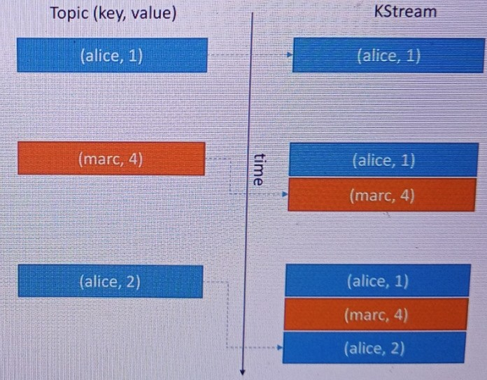
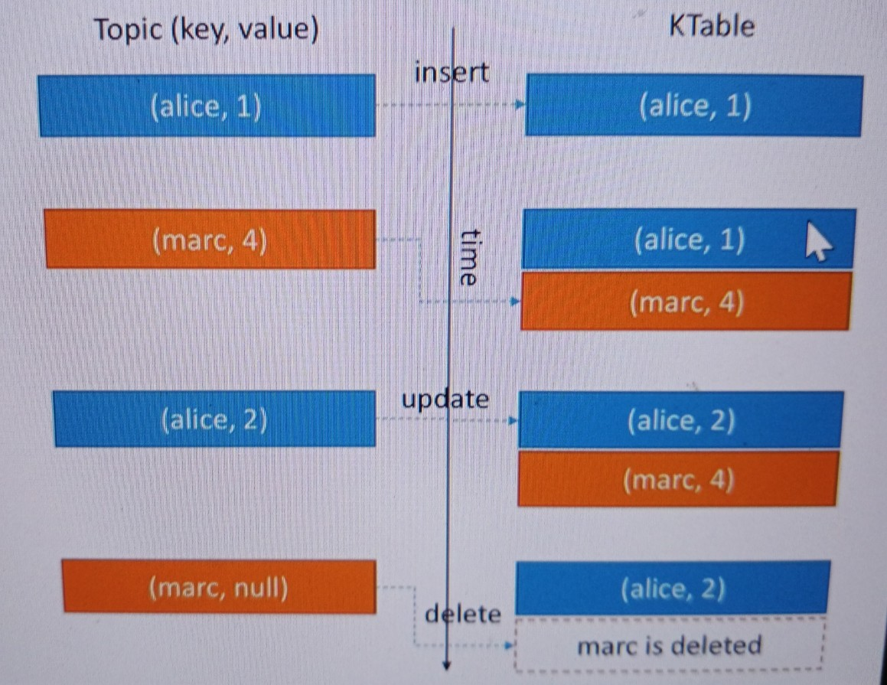

                                                                                                                                           # What is kafka streams?
* Library to process and transform data within kafka 
* Used for
	* Data transformations
	* Data Enrichment
	* Fraud Detection
	* Monitoring and Alerting
* Standard java application library
* No need to create separate kafka clusters
* Highly scalable, elastic and fault tolerant
* Exactly once capabilities - means process the record exactly once
* Processes one record at a time (no batching)
* Works for any application size\
------
# Internal topics
* Running kafka streams creates internal intermediary topics
* Two types
	* Repartitioning topics: In case you start transforming the key of your stream then repartitioning will happen at some processor
	* Changelog topic: In case you perform aggregation then kafka streams will save compacted data in these topics
* Internal topics
	* Managed by kafka streams
	* Are used by kafka streams to save/restore state and re-partition data
	* Are prefixed by `application.id` parameter
	* Should never be deleted, altered and published to
------
# KStreams
* All `inserts`
* Similar to log
* Infinite
* Unbounded data streams\

------
# KTable
* Upserts on non null values
* Deletes on null values
* Similar to table
* Parallel with log compacted topics

------
# When to KStreams vs KTable
* KStreams reading from topic that is not compacted
* KTable reading from topic that is log compacted (aggregations)

* KStream if new data is partial information or transactional
* KTable if you need structures like `database table` where every update is atomic (example: Total Bank balance)
------
# Filter and FilterNot
* Takes one record and produces zero or one record

## Filter
* Does not change keys or values
* Does not trigger re-partition
* For KStreams and KTables
* example
```
KStream<String, Long> positives = stream.filter((key,value) -> value > 0);
```
* Above example keeps record (foo, 10). Deletes (bar, -5)

## FilterNot
* Inverse of Filter
------
# Map and MapValues
* Takes one record and produces one record

## MapValues
* Only effecting values
* Does not change keys
* Does not trigger re-partition
* For KStreams and KTables
* Example. (foo, bar) -> (foo, BAR)
```
KStream<byte[], String> upperCase = stream.mapValues(value -> value.toUpperCase());
```

## Map
* Effects both keys and values
* Triggers re-partition
* For KStreams only
------
# FlatMap and FlatMapValues
* Takes one record and produces zero, one or more records

## FlatMapValues
* Does not changes keys
* Does not trigger re-partition
* For KStreams only
* Example
```
words = record.flatMapValues(value -> Arrays.asList(value.split("\\s+")));
```
* Output of above code
	* Input: (greet, welcome to kafka)
	* Output: (greet, welcome), (greet, to), (greet, kafka)
	
## FlatMap
* Changes keys
* Triggers re-partition
* For KStreams only
------
# Branch
* Branch: split KStream based on one or more predicates
* predicates are evaluated in order, if no matches, records are dropped
* You get multiple KStreams as a result
```
KStream<String, Long>[] branches = stream.branch(
	(key,value) -> value > 100, /* 1st predicate -> 1st branch */
	(key,value) -> value > 10, /* 2nd predicate -> 2nd branch */
	(key,value) -> value > 0, /* 3rd predicate -> 3rd branch */
);
```
------
# SelectKey
* Assigns new key to record (from old key and value)
* Triggers re-partitioning
* Best practice while coding - Isolate this code to know exactly where partitioning happens
```
resultStream = stream.selectKey((key, value) -> key.substring(0, 1));
```
* Output of above code
	* (foo, hello) -> (f, hello)
	* (bar, welcome) -> (b, welcome)
------
# KStream and KTable Reading from kafka
* Can read topic as KStream, KTable, GlobalKTable
* Reading as KStream
```
KStram<String, Long> wordCount = builder.stream(
	Serdes.String(), /* Key serde */
	Serdes.Long(), /* Value serder */
	"word-count-input-topic"
);
```
* Reading as KTable
```
KTable<String, Long> wordCount = builder.table(
	Serdes.String(), /* Key serde */
	Serdes.Long(), /* Value serder */
	"word-count-input-topic"
);
```
* Reading as GlobalKTable
```
GlobalKTable<String, Long> wordCount = builder.globalTable(
	Serdes.String(), /* Key serde */
	Serdes.Long(), /* Value serder */
	"word-count-input-topic"
);
```
------
# KStream and KTable writing to kafka
* Can write any KStream or KTable back to topic
* While writing KTable, think about create log compacted topic which save space and retrieval time
* To - Terminal Operation - write records to topic
```
stream.to("word-count-output")
stream.to("word-count-output", org.apache.kafka.streams.kstream.Produced.with(Serdes.String(), Serdes.Long()));

table.to("word-count-output")
table.toStream().to("word-count-output", org.apache.kafka.streams.kstream.Produced.with(Serdes.String(), Serdes.Long()));
```
* Through: write to topic and get stream / table from topic
```
KStream<String, Long> newStream = stream.through("user-clicks-topic");

KTable<String, Long> newStream = table.through("user-clicks-topic");
```
------
# Transform KTable to KStream
* Helpful to transform KTable to KStream in order to keep changelog of all the changes to KTable
* Can be done with below code
```
KTable<byte[], String> table = ...;

// Overloaded toStream() methods are available. Check API documentation
KStream<byte[], String> stream = table.toStream();
```
------
# Transform KStream to KTable
* 2 ways
* Using `groupByKey()` and aggregation step
```
KTable<String, Long> table = stream.groupByKey().count();
```
* Writing to kafka and read as KTable
```
stream.to("intermediary-topic")
stream.to("intermediary-topic", org.apache.kafka.streams.kstream.Produced.with(Serdes.String(), Serdes.Long()));

KTable<String, String> table = builder.table("intermediary-topic");
```
------
# Advanced transformations and operations
## KStream advanced operations
* peek
* Transform / TransformValues

## KTable stateful operations
* groupBy

## KGroupedStream / KGroupedTable operations
* count
* reduce
* aggregate
------
# KTable GroupBy
* Allows to perform more aggregations with in KTable
* Triggers re-partition because key changes
```
KTable<String, Integer> groupByTable = table.groupBy(
	(key,value) -> KeyValue.pair(value, value.length()),
	Serdes.String(), /* key (note: key is modified) */
	Serdes.Integer() /* value (note: type is modified from String to Integer) */
);
```
------
# KGroupedStream / KGroupedTable Count operation
* KGroupedStream / KGroupedTable are obtained after `groupBy / groupByKey` call on KStream / KTable
* `Count` counts the number of records by group key
* If used on KGroupedStream
	* Null keys or null values are ignored in count
* If used on KGroupedTable
	* Null keys are ignored
	* Null values are treated as `delete`
------
# KGroupedStream Aggregate
* Need `initializer (of any type)`, `adder`, `Serde for value`, `State Store Name (name of aggregation)`
* Example: Count total string length by key
```
KTable<byte[], Long> aggregateResult = groupedStream.aggregate(
	() -> 0L, /* initializer */
	(aggKey, newValue, currentAggregateValue) -> currentAggregateValue + newValue.length(), /* adder */
	Serdes.Long(), /* serde for aggregate value */
	"aggregated-stream-store-name" /* state store name */
);
```
------
# KGroupedTable Aggregate
* Need `initializer (of any type)`, `adder`, `substractor`, `Serde for value`, `State Store Name (name of aggregation)`
* Example: Count total string length by key
```
KTable<byte[], Long> aggregateResult = groupedStream.aggregate(
	() -> 0L, /* initializer */
	(aggKey, newValue, currentAggregateValue) -> currentAggregateValue + newValue.length(), /* adder */
	(aggKey, newValue, currentAggregateValue) -> currentAggregateValue - newValue.length(), /* substractor */
	Serdes.Long(), /* serde for aggregate value */
	"aggregated-table-store-name" /* state store name */
);
```
------
# KGroupedStream KGroupedTable Reduce
* Similar to Aggregate but the result type has to be same as input type
* (Int, Int) -> Int (example: a * b)
* (String, String) -> String (example: concat(a,b))
* Code sample
```
KTable<String, String> aggregatedStream = groupedStream.reduce(
	(agggregateValue, newValue) -> agggregateValue + newValue, /* adder */
	"reduce-stream-store-name" /* state store name */
);

KTable<Long, Long> aggregatedStream = groupedTable.reduce(
	(agggregateValue, newValue) -> agggregateValue + newValue, /* adder */
	(agggregateValue, newValue) -> agggregateValue - newValue, /* substractor */
	"reduce-stream-store-name" /* state store name */
);
```
------
# KStream peek
* Allows to apply side effect opeations on KStream and return same KStream as result
* Side effects could be
	* printing stream to the console
	* Statistics collection like number of records processed etc
* Warning: It could be execute multiple times (in case of failure). Means no guarantee of processed only once
```
KStream<byte[], String> stream = ...;

KStream<byte[], String> printStream = stream.peek(
	(key, value) -> System.out.println("key = " + key + "value = " + value)
);
```
------
# KStream Transform TransformValues
* Applies `Transform` to each record
* `Transform` leverages low level `Processor API`
* TransformValues does not trigger re-partition
------
# Joins
* What is join? - Joining means taking KStream / KTable and creating new KStream / KTable from it
* Windowed joins - limiting the data that we join by date time. With this we can limit the amount of data we join
* Join types
	* [Operand] - [Type] - [INNER JOIN / JOIN] - [LEFT JOIN] - [OUTER JOIN]
	* KStream to KStream - Windowed - Supported - Supported - Supported
	* KTable to KTable - Non-Windowed - Supported - Supported - Supported
	* KStream to KTable - Non-Windowed - Supported - Supported - Not Supported
	* KStream to GlobalKTable - Non-Windowed - Supported - Supported - Not Supported
	* KTable to GlobalKTable - N/A - Not Supported - Not Supported - Not Supported
* Read this blog to read detailed joins - https://www.confluent.io/blog/crossing-streams-joins-apache-kafka/
------
# Join Constraints and GlobalKTable
* 3 types of Joins
	* KStream to KStream
	* KTable to KTable
	* KStream to KTable
* Can happen only when data is co-partitioned. Otherwise join won't be doable and kafka stream will fail with Runtime error
* Co-partitioned: Same number of partitions are there in both Stream / table which participate in join
* To co-partition data if number of partitions are different, write back to topic throough kafka before join. This has network cost
------
# GlobalKTable
* If KTable data is reasonably small and can fit on each of your kafka streams application then we call it `GlobalKTable`
* With `GlobalKTable` you can join any stream to your table even if the data doesn't have same number of partitions. Because table data lives on every stream application instance
* Downside is size on disk. That's ok for reasonably sized dataset
------
# Types of Joins
* Inner Join or Join
* Left Join
* Outer Join

## Inner Join
* Matched data in both streams

## Lfet Join
* All the data on left whether or not it has match on right

## Outer Join
* Only available for KStream / KStream Joins