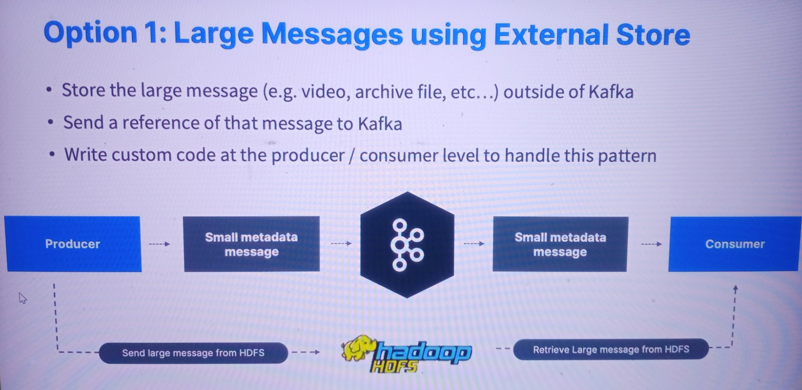
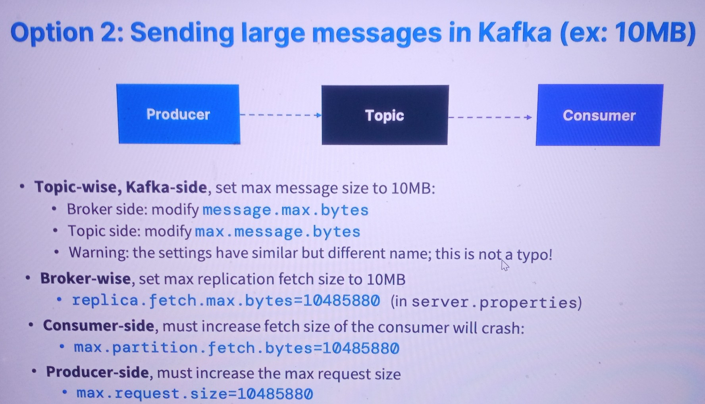

# Large Messages in Apache Kafka
Kafka has a default of 1 MB per message in topics, as large messages are considered inefficient and an anti-pattern.
## Two approaches to sending large messages:
1. **Using an external store**: Store messages in HDFS, Amazon S3, Google Cloud Storage, etc., and send a reference of that message to Apache Kafka.
2. **Modifying Kafka parameters**: Must change broker, producer, and consumer settings.
------
* Option 1\

* Option 2\
