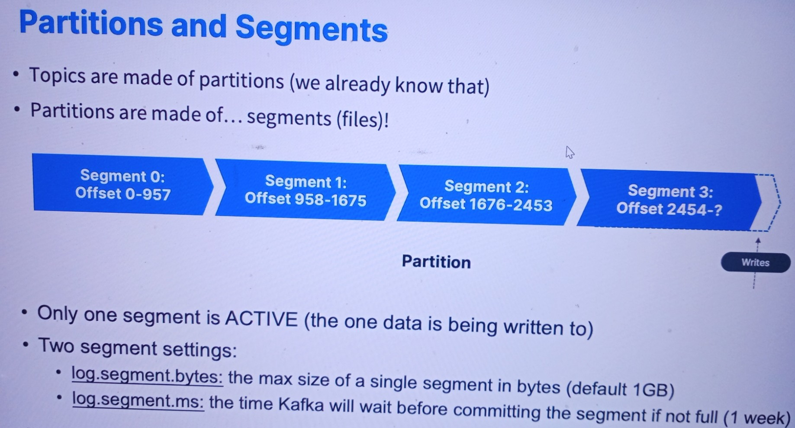

# Partitions and Segements
------
### Introduction
This document explains the relationship between topics, partitions, and segments in a data storage context, specifically related to Apache Kafka. Understanding these concepts is crucial for effectively managing Kafka data streams.

### Topics
* Definition: A topic is a category or feed name to which records are published.
* Structure: Topics are made up of multiple partitions.

### Partitions
* Definition: A partition is a subdivision of a topic.
* Structure: Partitions are composed of segments (files).

### Segments
* Definition: Segments are the files that store records within a partition.
* Active Segment: Only one segment is active at a time, i.e., the one being written to.

### Visual Representation
* Here is the segmentation of offsets within a partition:
* Segment 0: Offset 0-957
* Segment 1: Offset 958-1675
* Segment 2: Offset 1676-2453
* Segment 3: Offset 2454-?

### Segment Settings
* log.segment.bytes: This setting determines the maximum size of a single segment in bytes. The default size is 1GB.
* log.segment.ms: This setting specifies the time Kafka waits before committing a segment if it is not full. The default duration is 1 week.

### Conclusion
* Understanding the structure and settings of segments within partitions helps in optimizing Kafka's performance and storage management. Proper configuration of these settings ensures efficient data handling and timely segment rotation.
------
