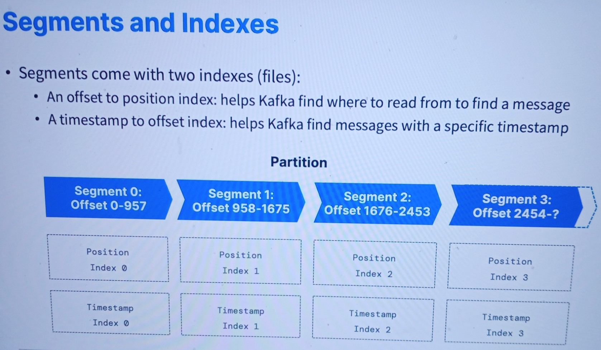
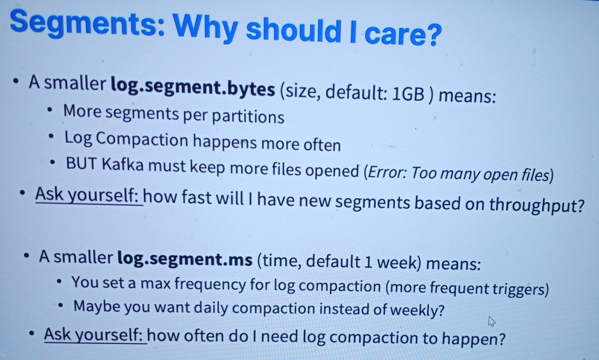

# Segments and Indexes
------
### Introduction
* This document explains the role of segments and indexes in Apache Kafka. Understanding these concepts is essential for efficient data handling and retrieval in Kafka.

### Segments
* Definition: Segments are files that store records within a partition of a Kafka topic.
* Indexes: Each segment comes with two types of indexes:
    * Offset to Position Index: Helps Kafka find the exact position to read from to locate a message.
    * Timestamp to Offset Index: Assists Kafka in finding messages based on specific timestamps.

### Partition Structure
* A partition is divided into multiple segments, each with its own offset range and corresponding indexes. Here is a representation of a partition with four segments:
* Segment 0: Offset 0-957
    * Position Index 0
    * Timestamp Index 0
* Segment 1: Offset 958-1675
    * Position Index 1
    * Timestamp Index 1
* Segment 2: Offset 1676-2453
    * Position Index 2
    * Timestamp Index 2
* Segment 3: Offset 2454-?
    * Position Index 3
    * Timestamp Index 3

### Conclusion
Segments and their associated indexes play a crucial role in Kafka's ability to efficiently store and retrieve messages. Proper understanding and configuration of these components ensure optimal performance and timely data access.
------

------
### Segments: Why should I care?
* A smaller log.segment.bytes (size, default: 1GB) means:
* More segments per partition
* Log Compaction happens more often
* BUT Kafka must keep more files open (Error: Too many open files)
* Ask yourself: how fast will I have new segments based on throughput?

### A smaller log.segment.ms (time, default: 1 week) means:
* You set a max frequency for log compaction (more frequent triggers)
* Maybe you want daily compaction instead of weekly?
* Ask yourself: how often do I need log compaction to happen?\
