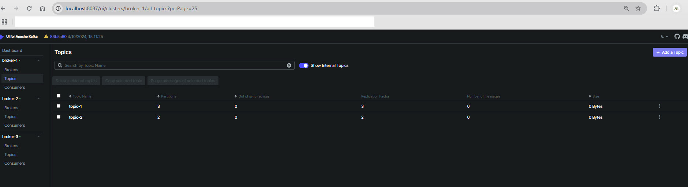

# Kafka setup with Docker
------
### Kafka with 1 broker and Kafka UI and default network
* Download file - [kafka-1-broker-with-ui.yml](kafka-1-broker-with-ui.yml)
* Run below command 
```
docker compose -f C:\path-to-kafka-1-broker-with-ui-yaml-file\kafka-1-broker-with-ui.yml up -d
or
docker-compose -f C:\path-to-kafka-1-broker-with-ui-yaml-file\kafka-1-broker-with-ui.yml up -d
```
* Wait for 2 minutes for Kakfka UI to initiate
* Open url - http://localhost:8080
* Stop containers
```
docker compose -f C:\path-to-docker-compose-yaml-file\file-name.yaml down
or
docker-compose -f C:\path-to-docker-compose-yaml-file\file-name.yaml down
```
* In this setup, our Zookeeper server is listening on port=2181 for the kafka service, which is defined within the same container setup. However, for any client running on the host, it'll be exposed on port 22181.
* Similarly, the kafka service is exposed to the host applications through port 29092, but it is actually advertised on port 9092 within the container environment configured by the KAFKA_ADVERTISED_LISTENERS property.
* Zookeeper url - `http://localhost:22181`
* Kafka broker url - `http://localhost:29092`
* Connect to kafka UI using tool like `Offset Explorer`
------
### Kafka with 1 broker and Kafka UI or our defined network
* Download file - [kafka-1-broker-ui-network.yml](kafka-1-broker-ui-network.yml)
* Run below command 
```
docker compose -f C:\path-to-kafka-1-broker-ui-network-yml-file\kafka-1-broker-ui-network.yml up -d
or
docker-compose -f C:\path-to-kafka-1-broker-ui-network-yml-file\kafka-1-broker-ui-network.yml up -d
```
* Wait for 2 minutes for Kakfka UI to initiate
* Open url - http://localhost:8080
* Stop containers
```
docker compose -f C:\path-to-docker-compose-yaml-file\file-name.yaml down
or
docker-compose -f C:\path-to-docker-compose-yaml-file\file-name.yaml down
```
* bootstrap servers to connect from java
```
localhost:29092
```
* In this setup, our Zookeeper server is listening on port=2181 for the kafka service, which is defined within the same container setup. However, for any client running on the host, it'll be exposed on port 22181.
* Similarly, the kafka service is exposed to the host applications through port 29092, but it is actually advertised on port 9092 within the container environment configured by the KAFKA_ADVERTISED_LISTENERS property.
* Zookeeper url - `http://localhost:22181`
* Kafka broker url - `http://localhost:29092`
* Connect to kafka UI using tool like `Offset Explorer`
------
### Kafka with 3 broker and Kafka UI or our defined network
* Download file - [kafka-with-3-brokers-and-kafka-ui.yml](kafka-with-3-brokers-and-kafka-ui.yaml)
* Run below command 
```
docker compose -f C:\path-to-kafka-with-3-brokers-and-kafka-ui-yml-file\kafka-with-3-brokers-and-kafka-ui.yaml up -d
or
docker-compose -f C:\path-to-kafka-with-3-brokers-and-kafka-ui-yml-file\kafka-with-3-brokers-and-kafka-ui.yaml up -d
```
* Wait for 2 minutes for Kakfka UI to initiate
* Open url - http://localhost:8087
* Stop containers
```
docker compose -f C:\path-to-docker-compose-yaml-file\file-name.yaml down
or
docker-compose -f C:\path-to-docker-compose-yaml-file\file-name.yaml down
```
* bootstrap servers to connect from java
```
localhost:9091,localhost:9092,localhost:9093
```
* Kafka UI\


------
# Reference
* https://www.baeldung.com/ops/kafka-docker-setup