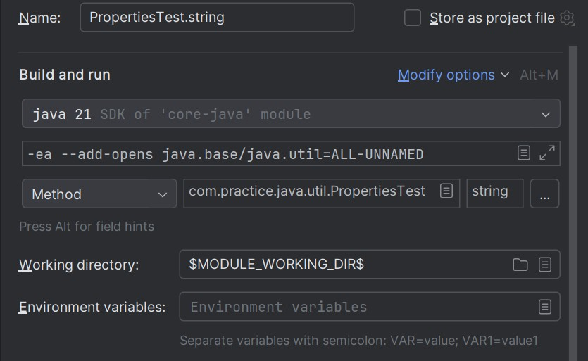

### Unable to make field private static final jdk.internal.misc.Unsafe java.util.Properties.UNSAFE accessible: module java.base does not opens java.util to unnamed module
------
* It looks like you're encountering an issue related to module encapsulation in Java 9 and later versions. This error occurs because the java.base module does not open the java.util package to unnamed modules by default
* Add below VM option while running jar file
```
java --add-opens java.base/java.util=ALL-UNNAMED -jar your-application.jar
```
* Add below VM option while running file from IntelliJ (File run configuration - Add VM Options)
```
--add-opens java.base/java.util=ALL-UNNAMED
```
