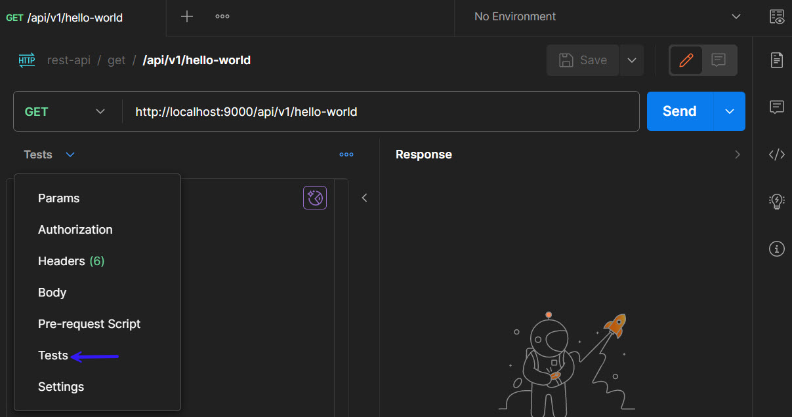

# Validate API Response
------
* Write test scripts in `Tests` tab\

* To write validations, we need to get API response to test scripts. Use below code to get response in `Test` tab
```
var response = pm.response.json()
```
* To print response in the console
```
console.log(JSON.stringify(pm.response.json()))
```