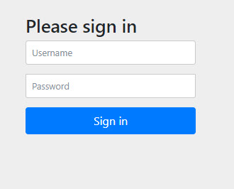

# Credentials In Properties
* Implementing basic spring boot 3 spring security 6
* Define credentials in application properties file
------
# How to run application?
* Application starts on port 9000

## Method 1
* Import code to IDE (IntelliJ or Eclipse)
* Run main class - [Main](src/main/java/com/java/Main.java)
* Random password will be generated in application console

## Method 2
* Run below maven command
```
mvn clean compile spring-boot:run
```
* Random password will be generated in application console
------
# Explanation
* Add spring security dependency in [pom.xml](pom.xml)
```
<dependency>
    <groupId>org.springframework.boot</groupId>
    <artifactId>spring-boot-starter-security</artifactId>
</dependency>
```
* Add below 2 files in [application.properties](src/main/resources/application.properties)
```
spring.security.user.name=${SECURITY_USERNAME:user1}
spring.security.user.password=${SECURITY_PASSWORD:pwd1}
```
* Start the application
* Hit this API in browser - http://localhost:9000/status
* Following form will prompt for credentials\

* Enter credentials defined in [application.properties](src/main/resources/application.properties)
* We will get success response
------
# Files
* [pom.xml](pom.xml)
* Main class - [Main](src/main/java/com/java/Main.java)
* Controller - [AppController](src/main/java/com/java/controller/AppController.java)
* [application.properties](src/main/resources/application.properties)
* [Postman collection](postman/credentials-in-properties.postman_collection.json)